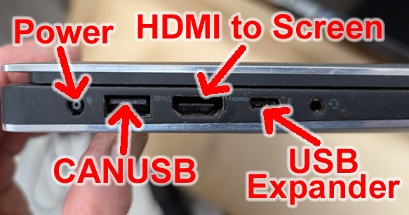

# Slattocks Junction - Connecting It All Up
*How to link up the laptop to the display panel and CBUS control system*
  
The control system consists of a laptop running JMRI connected to a large touch-screen and MERG CBUS. Numerous cables are used and the whole arrangement can look dauntng but is in fact quite straigntforward.
## The Laptop Connections

